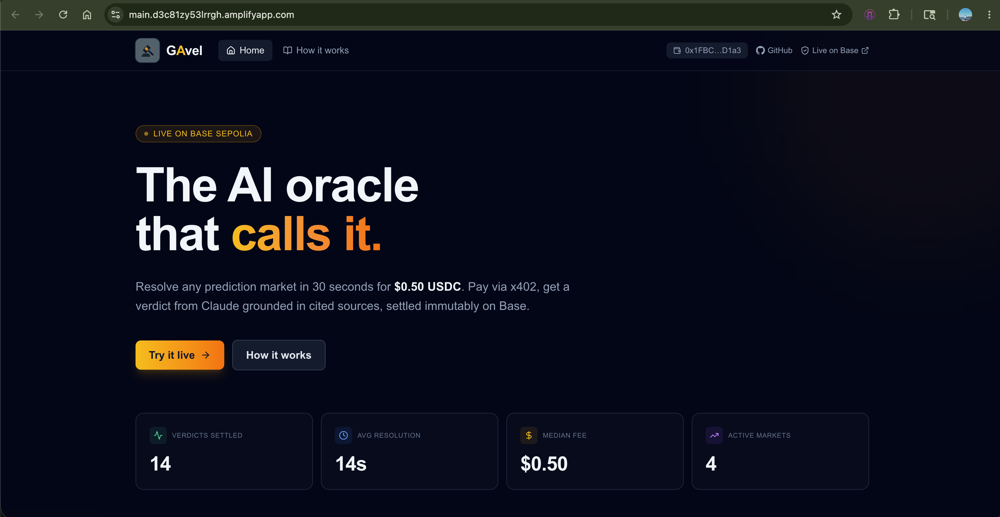
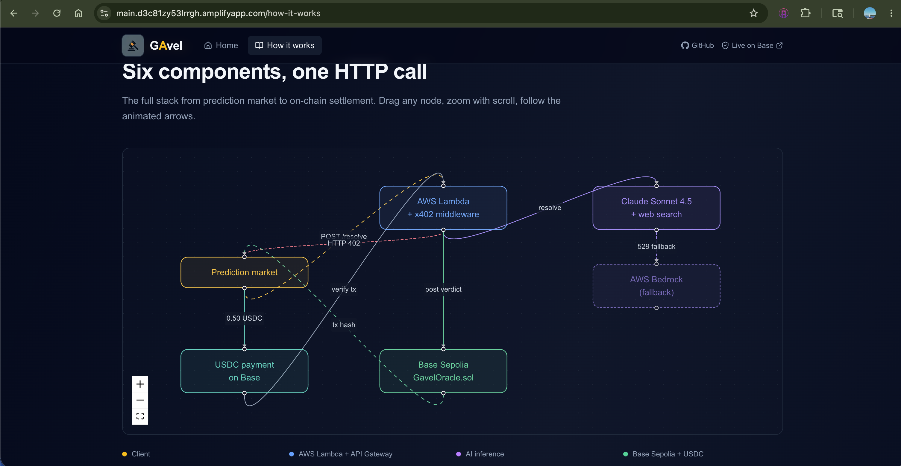
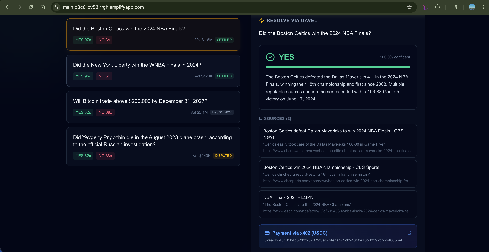
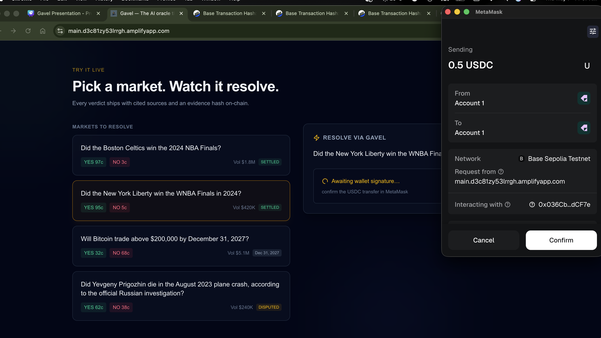

# Gavel

**The AI oracle that calls it.** Pay-per-query verdict resolution for prediction markets.

[](https://sepolia.basescan.org/address/0x781fF2E176196F2a3fDedA1a892d86FE0Bf42320)
[](https://twm1ztoxud.execute-api.us-east-1.amazonaws.com)
[](https://docs.cdp.coinbase.com/x402/welcome)
[](LICENSE)

> Built solo at the **EasyA Consensus Miami Hackathon** — May 5-7, 2026.
> Tracks: **Coinbase + AWS**.

---

## 🎥 Demo video

**Full walkthrough with audio — repo structure, live demo of the x402 payment flow, on-chain settlement, and Bedrock fallback:**

📺 **[Watch the Loom walkthrough →](https://www.loom.com/share/a7030b15f56d41dea6492905e55ea929)**

---

## 📸 UI screenshots

### Home page — markets, real-time resolution


### How it works — interactive architecture diagram


### Verdict result — sources + on-chain proof


### MetaMask payment flow


> *(Don't have screenshots yet? See [generating screenshots](#-generating-screenshots) at the bottom of this README — takes 5 minutes.)*

---

## 🧠 What Gavel does

Every prediction market — Polymarket, Kalshi, all of them — has the same broken layer: **oracle resolution**.

| Existing approach | Time | Cost | Trust model |
|---|---|---|---|
| **UMA optimistic oracle** | 24-48 hours | $5-50 per query | Stake-based dispute, public drama |
| **Centralized resolvers (Kalshi)** | Minutes-hours | Free, but opaque | Single party, has been gamed |
| **Polymarket today** | Hours-days | "Free" (operator pays) | A literal Slack channel of humans reading articles |
| **Gavel** | **~14 seconds** | **$0.50 USDC** | **Cited sources + on-chain evidence hash** |

Gavel fixes the most painful 95% of cases:

1. A prediction market **POSTs a yes/no question** to our API
2. Our server returns **HTTP 402** with x402 payment terms
3. The client **pays 0.50 USDC** on Base Sepolia
4. Our Lambda **verifies the on-chain Transfer event**
5. **Claude Sonnet 4.5** reasons over reputable sources (Reuters, AP, Bloomberg) via native `web_search`
6. The agent returns **YES / NO / UNRESOLVED** with cited sources
7. We **hash the evidence**, sign with our oracle wallet, and **write the verdict to GavelOracle.sol** on Base Sepolia
8. Caller receives the verdict + tx hashes for both payment and settlement

**Total: ~14 seconds end-to-end on a warm Lambda.**

---

## ⛓️ How blockchain interaction works

This is the most important section for hackathon judging — Gavel uses Base Sepolia in **two distinct ways**, and both are essential to the design.

### 1. Incoming: x402 payment verification

When a client calls `POST /resolve` without payment, the server returns **HTTP 402 Payment Required** with x402 headers:

```http
HTTP/2 402
accept-payment: x402 base-sepolia usdc 500000
content-type: application/json

{
  "x402Version": 1,
  "accepts": [{
    "scheme": "exact",
    "network": "base-sepolia",
    "maxAmountRequired": "500000",
    "asset": "0x036CbD53842c5426634e7929541eC2318f3dCF7e",
    "payTo": "0x1FBC0968103F9865eDab69E9F7140B509Cf5D1a3"
  }]
}
```

The client signs an ERC-20 `transfer()` of 500,000 micro-USDC (= 0.50 USDC) to our recipient on Base Sepolia, then retries the request with `X-Payment: <tx_hash>`. Our Lambda then:

1. Fetches the transaction receipt via `web3.py` (Base Sepolia RPC)
2. Parses the `Transfer(address,address,uint256)` event from USDC contract logs
3. Verifies: amount ≥ 500000, `to == our recipient`, `asset == USDC`, status == success
4. Adds the tx hash to an in-memory **replay-protection set** so it can't be reused
5. Only then does the resolution proceed

### 2. Outgoing: verdict settlement

After Claude returns a verdict, the server settles it on-chain:

1. `keccak256(question_text)` → `questionHash`
2. `keccak256(json.dumps(sources))` → `evidenceHash`
3. Sign a transaction with our oracle wallet (`0x1FBC...D1a3`)
4. Call `recordVerdict(questionHash, verdict, confidence, evidenceHash)` on `GavelOracle.sol`
5. Contract reverts on duplicate `questionHash` (no double-resolution)
6. Contract is signer-restricted (only our oracle wallet can write)
7. Returns `tx_hash` and `block_number` to the caller

**Result: every Gavel verdict has two on-chain receipts** — one proving the user paid, one proving the verdict was recorded immutably. Both visible on Basescan. Both tied to the same evidence hash.

This is the trust story. **You don't trust the LLM — you trust the cited sources.** If a verdict is wrong, you don't argue with Claude; you point at the article that contradicts it. The evidence is hashed on-chain, so any tampering would be visible.

---

## 🚀 Live deployment

| Component | Value |
|---|---|
| **Frontend** | _(deploy URL — set after Amplify deploy)_ |
| **API** | https://twm1ztoxud.execute-api.us-east-1.amazonaws.com |
| **Smart contract** | [`0x781fF2E176196F2a3fDedA1a892d86FE0Bf42320`](https://sepolia.basescan.org/address/0x781fF2E176196F2a3fDedA1a892d86FE0Bf42320) |
| **Oracle signer** | `0x1FBC0968103F9865eDab69E9F7140B509Cf5D1a3` |
| **USDC contract** | `0x036CbD53842c5426634e7929541eC2318f3dCF7e` |
| **Network** | Base Sepolia (chain id 84532) |
| **AI model** | Claude Sonnet 4.5 (primary) · `us.anthropic.claude-sonnet-4-5-20250929-v1:0` (Bedrock fallback) |

### Try it from the command line

```bash
# 1) Unpaid call → HTTP 402 with payment terms
curl -i -X POST https://twm1ztoxud.execute-api.us-east-1.amazonaws.com/resolve \
  -H "Content-Type: application/json" \
  -d '{"question": "Did Argentina win the FIFA World Cup in Qatar 2022?"}'

# Response:
# HTTP/2 402
# accept-payment: x402 base-sepolia usdc 500000
# content-type: application/json
# {
#   "x402Version": 1,
#   "accepts": [{ "network": "base-sepolia", "maxAmountRequired": "500000", ... }]
# }

# 2) Pay 0.50 USDC on Base Sepolia, then retry with X-Payment header
curl -X POST https://twm1ztoxud.execute-api.us-east-1.amazonaws.com/resolve \
  -H "Content-Type: application/json" \
  -H "X-Payment: 0xYOUR_PAYMENT_TX_HASH" \
  -d '{"question": "Did Argentina win the FIFA World Cup in Qatar 2022?"}'

# Returns:
# {
#   "verdict": "YES",
#   "confidence": 1.0,
#   "reasoning": "Argentina defeated France 4-2 on penalties...",
#   "sources": [...],
#   "model": "claude-sonnet-4-5",
#   "elapsed_ms": 13331,
#   "onchain": {
#     "tx_hash": "0xeb7e0b85...",
#     "block_number": 41166090,
#     "explorer_url": "https://sepolia.basescan.org/tx/...",
#     "question_hash": "0xa3f2b1c4...",
#     "evidence_hash": "0x7d8f1e2a...",
#     "chain_id": 84532
#   }
# }
```

### Try it with the reference paying client

```bash
git clone https://github.com/gaganv007/Gavel
cd Gavel/client
export GAVEL_API=https://twm1ztoxud.execute-api.us-east-1.amazonaws.com
export CLIENT_PRIVATE_KEY=0x...   # Base Sepolia wallet with ≥ 0.50 USDC + a tiny bit of ETH for gas

python pay_and_resolve.py "Did the Boston Celtics win the 2024 NBA Finals?"
# Sends USDC, waits for confirmation, gets the verdict — full x402 loop in ~20s.
```

---

## 🛠 Stack

| Layer | Tech | Why |
|---|---|---|
| **AI agent** | Claude Sonnet 4.5 + native `web_search` tool | Reasons over reputable sources (Reuters, AP, Bloomberg, etc.); returns structured JSON |
| **Backend** | FastAPI + Mangum on AWS Lambda + API Gateway | Serverless, scales to zero, deployed via SAM |
| **Payments** | Coinbase **x402** + USDC on **Base Sepolia** | Pay-per-query without API keys, Stripe, or onboarding |
| **Settlement** | Solidity 0.8 contract on Base Sepolia | Tamper-evident verdict storage with evidence hash |
| **Frontend** | Next.js 16 + Tailwind + wagmi + viem + reactflow + framer-motion | Real MetaMask integration; interactive architecture diagram |
| **Resilience** | **AWS Bedrock** fallback | When Anthropic API 529s, fall over to Sonnet 4.5 on AWS — separate quota pool |
| **Hosting** | AWS Amplify (frontend) + AWS Lambda (backend) | One-click deploys from GitHub; secrets via NoEcho CloudFormation params |

---

## 🏗 How the sponsor tech made this uniquely possible

### Coinbase x402

HTTP 402 was deprecated since HTTP/1.1. **x402 reactivates it as a stablecoin payment protocol** — the missing piece for machine-to-machine commerce.

Without x402, Gavel would need API keys + Stripe + customer onboarding flows — none of which fit pay-per-query economics. With x402, **every prediction market can call us programmatically** by sending 0.50 USDC. No accounts, no rate limits, no onboarding.

The middleware in `api/x402.py` fully implements the server side:
- Returns proper `HTTP 402` with `accept-payment` header and JSON body matching the x402 spec
- Verifies the on-chain `Transfer` event by parsing tx logs (`web3.py 7.x` — handles both `0x`-prefixed and unprefixed topic hex)
- Replay-protected with an in-memory tx-hash set
- Reference paying client at `client/pay_and_resolve.py` demonstrates the full loop

### Base

Coinbase's L2. **~$0.001 in gas per verdict settlement.** We chose Base Sepolia for the testnet demo; the same code redeploys to Base mainnet with one config change.

Both the x402 USDC payment AND the verdict settlement happen on Base, giving end-to-end on-chain visibility — every Gavel verdict has two Basescan transactions tied to the same evidence hash.

### AWS Lambda

Serverless **scales to zero between queries** — perfect for pay-per-query economics where each query costs the user 50 cents and us about 5 cents.

- ARM64 + Python 3.11 keeps cold-start times reasonable (~3s)
- Deployed via AWS SAM (`template.yaml`)
- Secrets (`ANTHROPIC_API_KEY`, `ORACLE_PRIVATE_KEY`) stored as **NoEcho CloudFormation parameters** — never logged
- API Gateway HTTP API in front for routing

### AWS Bedrock

When `api.anthropic.com` returns `529 overloaded` (which it can during traffic spikes), Gavel falls over to **Claude Sonnet 4.5 on AWS Bedrock** — same model, separate quota pool, AWS-native infrastructure.

This matters for two reasons:
1. **Demo resilience** — the system stays alive during Anthropic API incidents
2. **Enterprise compliance** — customers who need their entire AI stack inside AWS can use Bedrock-only mode

The fallback is IAM-permissioned (`bedrock:InvokeModel` scoped to the Gavel Lambda's role) and uses the inference profile `us.anthropic.claude-sonnet-4-5-20250929-v1:0`.

---

## 📁 Repo structure

```
gavel/
├── api/                          # FastAPI backend (deployed to Lambda)
│   ├── agent.py                  # Claude reasoning + retry/backoff + Bedrock fallback
│   ├── main.py                   # HTTP routes, x402 gating, settlement orchestration
│   ├── onchain.py                # web3.py signing + GavelOracle.sol writes
│   ├── x402.py                   # x402 middleware: HTTP 402 + payment verify
│   ├── lambda_handler.py         # Mangum adapter
│   ├── requirements.txt
│   └── .env.example
│
├── contracts/                    # Foundry project
│   ├── src/GavelOracle.sol       # Signer-only writes, evidence hash, VerdictKind enum
│   ├── test/GavelOracle.t.sol    # 4 passing tests
│   ├── script/Deploy.s.sol
│   └── lib/forge-std (submodule)
│
├── client/
│   └── pay_and_resolve.py        # Reference x402 paying client (full loop demo)
│
├── frontend/                     # Next.js + wagmi
│   ├── app/
│   │   ├── page.tsx              # Home: hero, stat strip, markets, resolve panel
│   │   ├── how-it-works/page.tsx # Architecture, stages, FAQ
│   │   ├── _components/Nav.tsx   # Shared nav
│   │   ├── providers.tsx         # WagmiProvider + QueryClient
│   │   └── layout.tsx
│   ├── public/
│   │   └── gavel_logo.png
│   └── next.config.ts            # CSP allows unsafe-eval (wagmi requirement)
│
├── docs/
│   └── screenshots/              # UI screenshots referenced in this README
│
├── template.yaml                 # SAM: ARM64 Lambda, Bedrock IAM, env vars
├── samconfig.toml.example
├── amplify.yml                   # Amplify Hosting build config
└── README.md                     # You are here
```

---

## 🧪 Local setup

### Backend

```bash
cd api
python3 -m venv .venv && source .venv/bin/activate
pip install -r requirements.txt
cp .env.example .env
# Fill in .env:
#   ANTHROPIC_API_KEY=sk-ant-...
#   ORACLE_PRIVATE_KEY=0x...   (Base Sepolia wallet that's authorized in the contract)
#   ORACLE_CONTRACT_ADDRESS=0x781fF2E176196F2a3fDedA1a892d86FE0Bf42320
#   BASE_RPC_URL=https://sepolia.base.org
#   X402_ENABLED=true
#   X402_RECIPIENT=0x1FBC0968103F9865eDab69E9F7140B509Cf5D1a3
#   BEDROCK_FALLBACK_ENABLED=true
#   BEDROCK_MODEL_ID=us.anthropic.claude-sonnet-4-5-20250929-v1:0

uvicorn main:app --port 8000
```

### Smart contract

```bash
cd contracts
forge build
forge test -vv

# Deploy (already done — contract live at 0x781f...2320)
forge script script/Deploy.s.sol:Deploy \
  --rpc-url https://sepolia.base.org \
  --private-key $PRIVATE_KEY \
  --broadcast
```

### Frontend

```bash
cd frontend
npm install --legacy-peer-deps
echo "NEXT_PUBLIC_API_URL=http://localhost:8000" > .env.local
echo "NEXT_PUBLIC_BASESCAN_URL=https://sepolia.basescan.org" >> .env.local
echo "NEXT_PUBLIC_CONTRACT_ADDRESS=0x781fF2E176196F2a3fDedA1a892d86FE0Bf42320" >> .env.local

npm run dev
# → http://localhost:3000
```

---

## 🚢 Deployment

### Backend → AWS Lambda via SAM

```bash
# One-time: copy and fill in samconfig
cp samconfig.toml.example samconfig.toml
# Edit parameter_overrides with your AnthropicApiKey, OraclePrivateKey, etc.

# Build + deploy
sam build --use-container
sam deploy
# → outputs the API URL after ~3 minutes
```

The SAM template (`template.yaml`) provisions:
- ARM64 Python 3.11 Lambda function (1024 MB, 90s timeout)
- API Gateway HTTP API with `/{proxy+}` route
- IAM policy for `bedrock:InvokeModel` and `bedrock:InvokeModelWithResponseStream`
- All env vars wired from CloudFormation parameters (NoEcho for secrets)

### Frontend → AWS Amplify Hosting

The `amplify.yml` at the repo root configures Amplify to build the `frontend/` subdirectory:

1. Connect GitHub repo to Amplify in the AWS console
2. Set monorepo root to `frontend`
3. Add three env vars: `NEXT_PUBLIC_API_URL`, `NEXT_PUBLIC_BASESCAN_URL`, `NEXT_PUBLIC_CONTRACT_ADDRESS`
4. Every push to `main` auto-deploys

---

## 🎯 Hackathon judging — how Gavel scores

| Criterion | Score |
|---|---|
| **Execution** | UI works end-to-end · MetaMask integration is real (not simulated) · AWS deployed · contract verified on Basescan · 4 passing Foundry tests |
| **Usefulness** | $50B+ flowed through prediction markets in 2024; resolution is the broken layer; pay-per-query economics enabled by x402 |
| **Learning** | Custom x402 middleware (no SDK existed) · Bedrock fallback with separate quota pool · on-chain evidence hashing — none of these were tutorials |
| **Use of blockchain** | Dual on-chain pattern: payment verification + verdict settlement; tamper-evident audit trail; smart contract has signer-only writes and duplicate protection |
| **Deployment** | Live on Base Sepolia · AWS Lambda + API Gateway · AWS Amplify hosting · open-source on GitHub |

---

## 🗣 The pitch

**Why should anyone trust an LLM verdict?**

You're not trusting the LLM — you're trusting the cited sources. Every verdict ships with Reuters, AP, Bloomberg URLs and a `keccak256` evidence hash on-chain. If a verdict is wrong, you don't argue with Claude — you point at the article that contradicts it.

Polymarket today has a Slack channel of humans reading the same articles every prediction market reads. Gavel just does that **100x faster, with a public audit trail**.

**What about disputed questions?**

Gavel can return `UNRESOLVED` with low confidence when sources conflict, and the prompt explicitly tells the agent to do this rather than guess. The market operator can also tighten or loosen this threshold per query.

**Why Gavel and not just GPT-4 directly?**

Three things: signed on-chain settlement, evidence hashing, and an SLA. Markets don't want to run their own LLM infra and trust their own outputs — they want a neutral, paid-for, auditable third party. That's why Chainlink exists.

---

## 🛣 Roadmap

| Timeline | Milestone |
|---|---|
| **Now** | Hackathon MVP: single-signer wallet, Base Sepolia, 4 demo markets, live API + frontend |
| **+30 days** | Mainnet + dispute escrow ($5 stake to challenge a verdict, loser pays); multisig signers; deployment to Base mainnet + Polygon |
| **+90 days** | Polymarket integration pilot; Kalshi conversations; signer running inside Intel SGX TEE so even Gavel can't tamper |
| **Long-term** | The neutral resolution protocol for the entire prediction-market ecosystem. Cite-the-source as a service. |

---

## 📸 Generating screenshots

If you're forking this repo and need to regenerate the screenshots in `docs/screenshots/`:

1. Run the frontend locally: `cd frontend && npm run dev`
2. Open http://localhost:3000 in Chrome at 1280×800 (use DevTools device toolbar)
3. Take screenshots with `Cmd+Shift+4` on macOS (or Snipping Tool on Windows):
   - `home.png` — full home page
   - `how-it-works.png` — `/how-it-works` page, scrolled to the architecture diagram
   - `verdict.png` — completed resolution showing the YES verdict + tx blocks
   - `metamask.png` — MetaMask popup mid-payment

Save them all into `docs/screenshots/` and commit.

---

## 👤 Team

Built by **Gagan Veginati** ([@gaganv007](https://github.com/gaganv007))
Boston University · MS Computer Science

---

## 📝 License

[MIT](LICENSE) — free to fork, modify, and use commercially.

---

*Built solo at the EasyA Consensus Miami hackathon · May 5-7, 2026 · Coinbase + AWS track. The AI oracle that calls it.*
